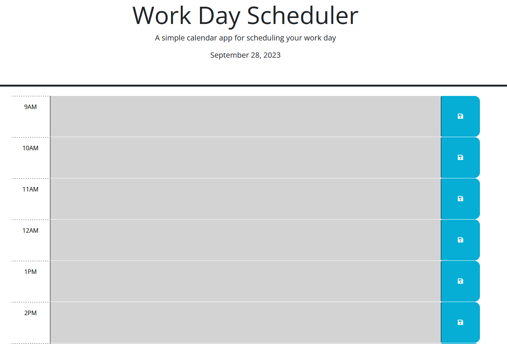

# Work Day Scheduler

## Description

This project was created to practice using third-party functional APIs (Day.js, Bootstrap, etc.) and make use of JSON and localstorage. A work day scheduler MVP is a perfect practice, and can also be used in the future to be further developed into a usable application. I learned how to use JSON and localstorage to store non-primitive data, and how to use Day.js for time-based functionality.

## Usage

Textboxes change color based on hour of day (gray is past, red is present, green is future). Saving works by clicking the save button would save the hour & text to an object (or overwrite the object if the hour is the same) and save it to the localstorage in JSON format. On page load, textboxes will be filled with text from the re-parsed localstorage.

[Link to GitHub Pages website](https://kevinpatto.github.io/Bootcamp-Challenge-05-Work-Day-Scheduler/)

## Credits

N/A

## License

N/A
